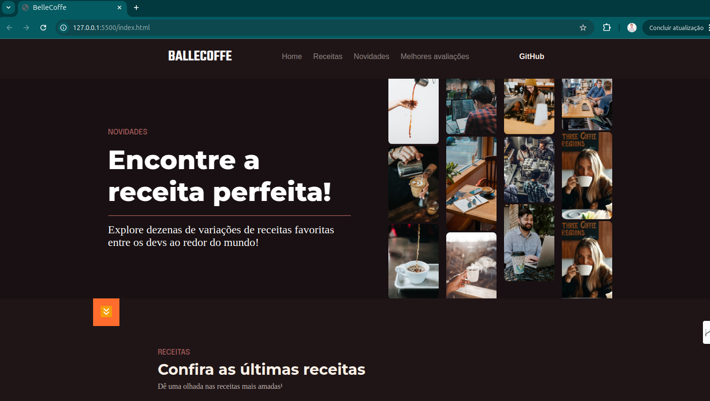
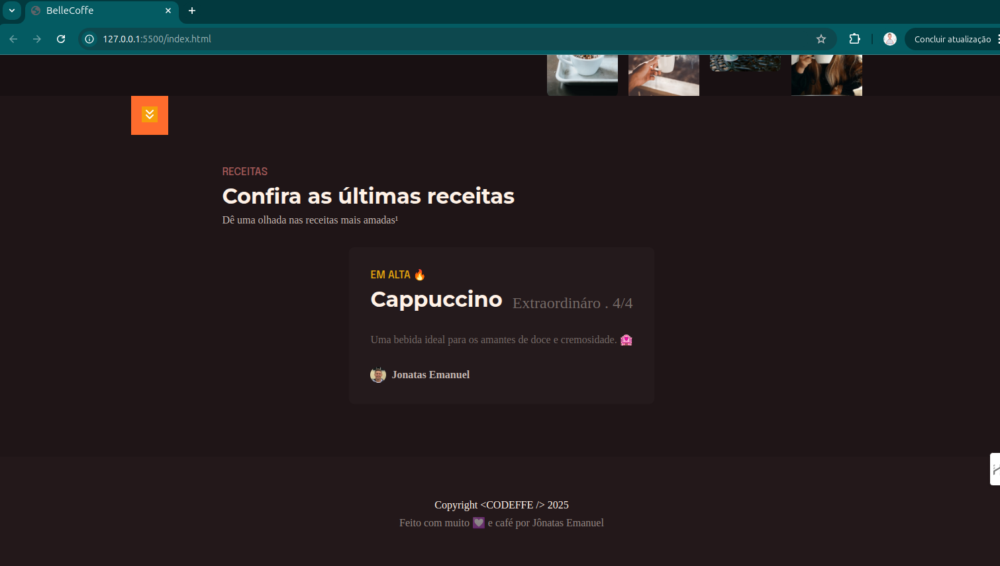

# Landing Page - Projeto Web Responsivo

Seja bem-vindo(a) ao repositório da **Landing Page**!  
Este projeto foi desenvolvido utilizando as tecnologias **HTML5** e **CSS3**, com o objetivo de criar uma página moderna, responsiva e visualmente atraente.  

A proposta é apresentar um layout profissional, focado na simplicidade, performance e boa experiência de navegação.

---

## 📸 Preview do Projeto

Abaixo estão algumas imagens que ilustram o resultado final da landing page:

<p align="center">
  
</p>

<p align="center">
  
</p>

---

## 🛠️ Tecnologias Utilizadas

- **HTML5** — Estruturação do conteúdo da página
- **CSS3** — Estilização, design responsivo e animações
- **Google Fonts** — Tipografia personalizada para tornar o design mais moderno

---

## 📂 Estrutura de Pastas

📁 assets/ ├── part1.png ├── part2.png 📄 index.html 📄 style.css


- `index.html` — Arquivo principal que contém toda a estrutura da landing page.
- `style.css` — Arquivo responsável pelos estilos, animações e responsividade.
- `assets/` — Pasta onde estão armazenadas as imagens utilizadas no projeto.

---

## 🚀 Como Executar o Projeto Localmente

1. Clone este repositório para sua máquina:
   ```bash
   git clone https://github.com/seu-usuario/seu-repositorio.git


cd nome-do-projeto

    Abra o arquivo index.html no seu navegador preferido.

Não é necessário instalar nenhuma dependência! 🚀
🎯 Objetivos do Projeto

    Desenvolver uma landing page 100% responsiva

    Aplicar boas práticas de HTML e CSS

    Utilizar design clean e focado na experiência do usuário (UX)

    Construir um projeto rápido, leve e otimizado

